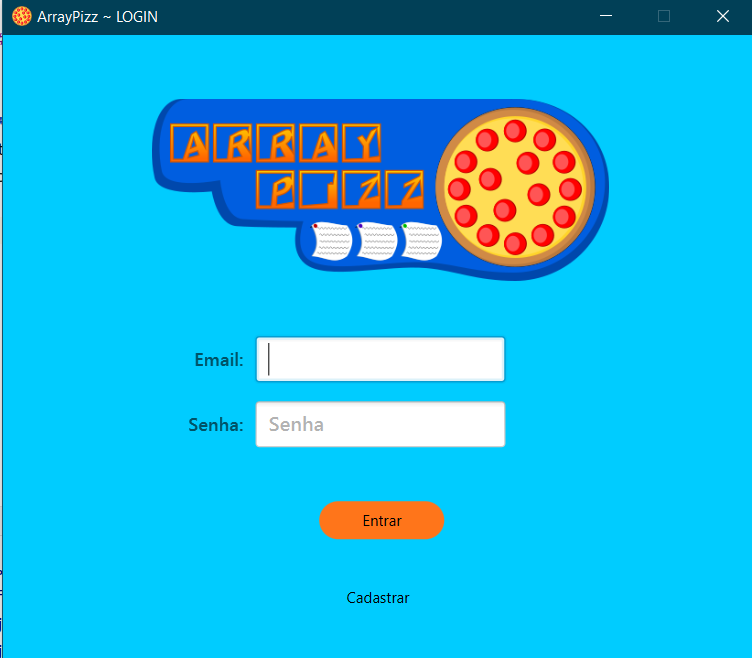
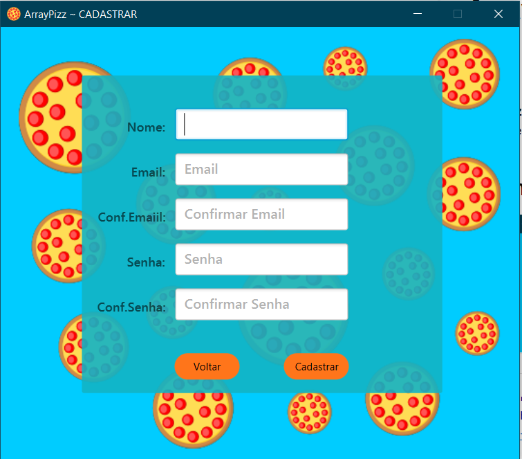
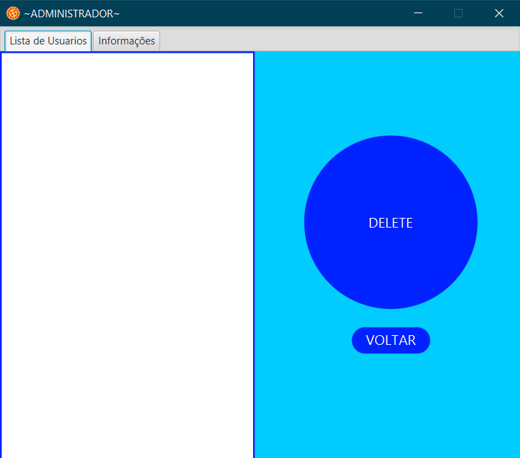
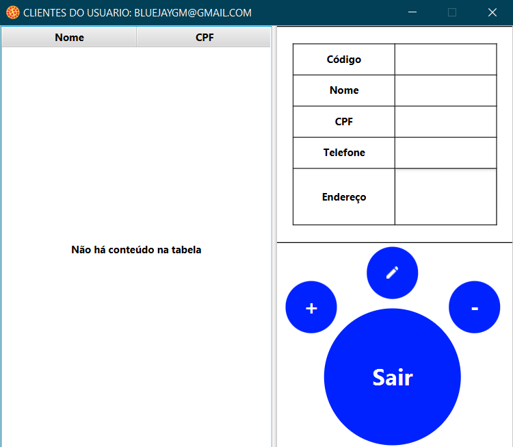

# ArrayPizz

## What is?

**ArrayPizz** is a project created to register users 
through a basic CRUD, saving their data in binary files 
of the .dat type

## Login

Login with your account already registered 
or start in admin mode with the user **admin** and password **root**

## Register

Register with your basic information to gain 
access to the app and manage your customers.

## Page To Admin

Manage all application users, whether employee or employees' customers.

## Page To Employees

Manage your customers and find them however you want.

## Makers

 - [BlueJayGM](https://github.com/BlueJayGM)
 - [GALMelo](https://github.com/GALMelo)